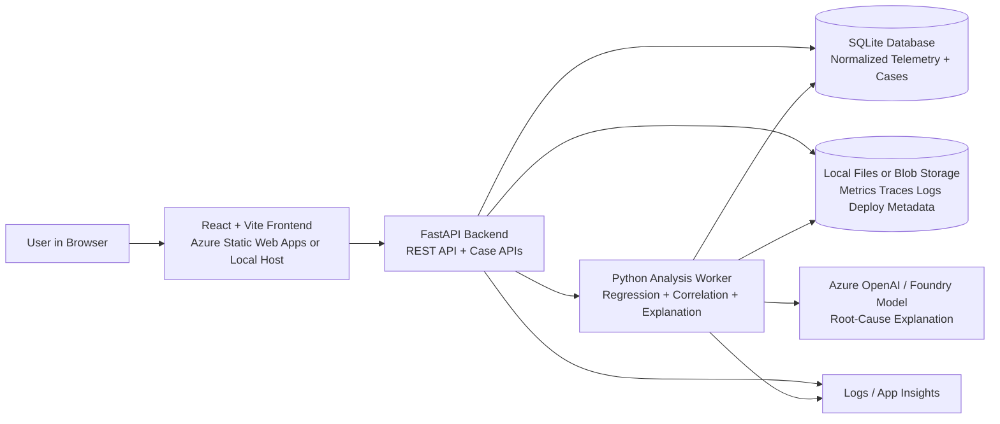
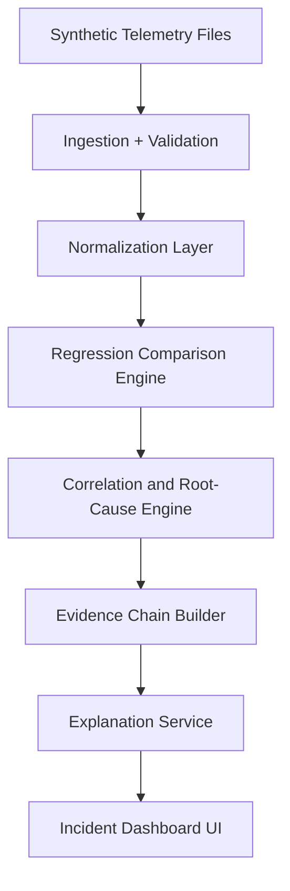

# AI Performance Reliability Engineer

## 1. Executive Summary

AI Performance Reliability Engineer is an AI-assisted engineering platform that helps teams understand, predict, and prevent performance degradation across distributed Conga business workflows.

For the hackathon, the platform should be presented as a broader reliability product with one real first agent:

- **AI Performance Regression Root-Cause Agent**

This gives the team a strong platform story while keeping the first implementation focused, measurable, and feasible with synthetic telemetry.

---

## 2. Problem Statement

After a release, engineers can usually see that latency or error rate got worse, but they often cannot quickly explain why.

Typical investigation pain:

- dashboards show symptoms but not cause
- traces show one slice of the system but not the full evidence chain
- logs, deploy metadata, scaling events, config changes, and downstream failures live in different tools
- engineers spend hours correlating data manually

In a platform like Conga, a single business flow such as quote generation or contract rendering can span many services and dependencies. The core problem is not just observability. The core problem is turning multi-signal telemetry into a trustworthy root-cause explanation.

---

## 3. Target Users

- Platform engineering teams
- SRE and reliability teams
- Performance engineering teams
- Backend service owners
- Release managers
- Engineering leaders who want business-impact explanation, not only raw telemetry

---

## 4. Hackathon Scope

### In Scope for MVP

- Ingest synthetic traces, metrics, logs, deploy metadata, config diffs, and dependency maps
- Compare before-release and after-release behavior
- Detect major regressions in latency or error rate
- Correlate likely contributing signals across services
- Produce a ranked root-cause explanation with confidence and evidence
- Show one clean incident timeline and evidence chain in the UI
- Support a small set of seeded incident patterns

### Out of Scope for MVP

- Live production telemetry ingestion
- Full distributed tracing platform replacement
- Real-time streaming analytics at production scale
- Autonomous remediation in production systems
- Training a custom model from scratch

---

## 5. Product Shape

AI Performance Reliability Engineer should be pitched as a multi-agent platform with a shared telemetry evidence layer.

### Platform Layer

- Shared telemetry ingestion
- Shared normalized evidence store
- Shared dependency graph
- Shared incident explanation engine

### First Real Agent

- **AI Performance Regression Root-Cause Agent**

### Future Agents

- AI Bottleneck Explainer for End-to-End Business Transactions
- AI Release Risk Scorer for Performance
- AI Workload Pattern Forecaster + Autoscaling Advisor
- AI Noisy-Neighbor / Tenant Impact Detector

---

## 6. End-to-End User Flow

1. User uploads or loads synthetic telemetry for a before-release period and an after-release period.
2. The system normalizes traces, metrics, logs, deploy metadata, and dependency information.
3. The regression engine detects what got worse and where the change is most visible.
4. The root-cause agent correlates related signals across services and dependencies.
5. The system assembles an evidence chain and ranks likely root causes.
6. User opens a regression case and sees:
   - what changed
   - which service or dependency contributed most
   - why the system believes this is the root cause
   - supporting evidence from traces, metrics, logs, and deploy/config metadata
   - confidence score and possible remediation hints

---

## 7. AI Responsibilities

AI should be used where signal correlation and causal explanation become too complex for simple rules.

### AI Tasks

- correlate metrics, traces, logs, deploy events, and config changes
- identify the most likely causal chain behind the regression
- summarize the regression in plain engineering language
- separate primary contributors from secondary contributors
- explain confidence and evidence behind the recommendation

### Non-AI Tasks

- file ingestion
- telemetry schema validation
- deterministic regression comparison math
- simple threshold checks
- UI rendering and filtering

This separation matters for the pitch. The AI is doing multi-signal reasoning and explanation, while the system still uses deterministic math for core comparisons.

---

## 8. Recommended Concrete Stack for the Hackathon

- Frontend: React + Vite
- Frontend hosting: Azure Static Web Apps or local dev server
- Backend API: Python FastAPI
- Analysis worker: Python service logic inside the same backend for MVP
- Model host: Azure OpenAI or Microsoft Foundry-hosted model
- Structured store: SQLite for MVP
- Raw telemetry storage: local JSONL and CSV files during hackathon, Azure Blob Storage if deployed
- Dependency graph storage: SQLite tables or JSON files for MVP
- Observability: application logs plus optional Azure Application Insights

### Why This Stack

- Python is a good fit for telemetry processing, JSONL handling, and AI orchestration.
- React gives a fast path to a strong investigation UI.
- SQLite keeps local development simple and demoable.
- Hosted models avoid training complexity while still enabling AI-first reasoning.

---

## 9. Technology and Infrastructure Architecture

This is the actual technology and deployment architecture for the hackathon implementation.



### Connection Summary

- The browser talks only to the FastAPI backend through the frontend.
- FastAPI handles uploads, regression analysis requests, case lists, and drill-down APIs.
- The analysis worker performs telemetry normalization, comparison, correlation, and explanation.
- SQLite stores normalized telemetry summaries, case records, root-cause candidates, and evidence links.
- File storage keeps raw traces, metrics, logs, deploy metadata, and config diff files.
- The hosted model is used for correlation summarization and explanation, not for basic math or storage.

---

## 10. Logical Processing Flow

This is the internal data flow after telemetry is loaded.



---

## 11. Synthetic Data Setup Requirements

This section defines what synthetic data is required to make the root-cause agent believable.

### Core Goal

The synthetic environment must allow the system to answer four questions:

- what changed
- where the bottleneck moved
- what the likely root cause is
- what evidence supports that conclusion

### Required Data Categories

1. **Service inventory**
   - list of services involved in a business flow
   - service ownership and dependency map

2. **Release metadata**
   - release version
   - deployment timestamp
   - changed services
   - change type
   - config changes

3. **Metrics time series**
   - request volume
   - p50, p95, p99 latency
   - error rate
   - CPU
   - memory
   - thread pool usage
   - queue depth
   - DB connection usage
   - cache hit rate
   - autoscaling events

4. **Trace and span data**
   - end-to-end trace ids
   - per-service spans
   - span duration
   - status
   - retries
   - downstream dependency calls
   - wait time and queue time

5. **Log events**
   - timeout messages
   - retry storms
   - pool exhaustion messages
   - dependency failure logs
   - rollout warnings

6. **Dependency graph**
   - upstream and downstream services
   - critical shared dependencies such as DB, cache, queue, external services

7. **Ground-truth incident labels**
   - seeded root cause
   - primary contributor
   - secondary contributor
   - impacted services
   - blast radius

### Recommended Synthetic Service Map

Use service names that feel plausible for Conga business flows.

- `quote-pricing-api`
- `quote-config-service`
- `contract-renderer`
- `template-merge-worker`
- `approval-orchestrator`
- `billing-sync-worker`
- `tenant-metadata-api`
- `clm-doc-api`
- `postgres-primary`
- `redis-cache`

### Minimum Time Window

For each scenario, generate:

- 24 hours of before-release telemetry
- 24 hours of after-release telemetry
- one release event in the middle

For a richer demo, generate:

- 3 days before release
- 3 days after release
- one baseline release with no regression
- one problematic release with seeded regression

### Recommended Volumes for MVP

- 5 to 8 services
- 10,000 to 30,000 spans total
- 1-minute metrics resolution
- 200 to 500 log lines per scenario
- 3 to 5 seeded incidents

This is large enough to feel realistic but small enough to process locally.

### Required File Layout

```text
data/
  synthetic/
    services.json
    dependencies.json
    releases.csv
    configs/
      before_release.json
      after_release.json
    metrics/
      metrics_before.csv
      metrics_after.csv
    traces/
      traces_before.jsonl
      traces_after.jsonl
    logs/
      logs_before.jsonl
      logs_after.jsonl
    incidents/
      incident_labels.csv
      evidence_map.json
```

### Minimal Schema Requirements

#### services.json

- `service_name`
- `service_type`
- `owner_team`
- `criticality`

#### releases.csv

- `release_version`
- `release_time`
- `service_name`
- `change_category`
- `config_changed`
- `notes`

#### metrics_before.csv / metrics_after.csv

- `timestamp`
- `service_name`
- `request_count`
- `error_rate`
- `p50_ms`
- `p95_ms`
- `p99_ms`
- `cpu_percent`
- `memory_mb`
- `db_connections_used`
- `queue_depth`
- `replica_count`

#### traces_before.jsonl / traces_after.jsonl

- `trace_id`
- `span_id`
- `parent_span_id`
- `service_name`
- `operation_name`
- `start_time`
- `duration_ms`
- `status`
- `retry_count`
- `downstream_service`
- `queue_wait_ms`
- `db_wait_ms`
- `release_version`

#### logs_before.jsonl / logs_after.jsonl

- `timestamp`
- `service_name`
- `severity`
- `message`
- `error_code`
- `trace_id`
- `release_version`

#### incident_labels.csv

- `incident_id`
- `scenario_name`
- `release_version`
- `primary_root_cause`
- `secondary_root_cause`
- `impacted_service`
- `user_impact_summary`

### Seeded Incident Scenarios

At minimum, include these scenarios:

1. **DB connection pool saturation after release**
   - `quote-pricing-api` latency rises
   - DB wait time rises sharply
   - error rate rises modestly

2. **Retry storm after timeout threshold change**
   - `contract-renderer` timeout lowered
   - retries increase across downstream calls
   - p95 increases in more than one service

3. **Queue buildup after worker slowdown**
   - `template-merge-worker` gets slower
   - queue depth climbs
   - user-facing render latency rises later

4. **No regression control scenario**
   - release occurs
   - metrics stay stable
   - agent should avoid false positives

5. **Misleading secondary symptom scenario**
   - cache miss rate rises
   - real root cause is DB saturation or config regression
   - useful for testing causal ranking

### Generation Rules

- Keep one seeded primary root cause per scenario.
- Optionally add one secondary contributing factor.
- Make the evidence chain plausible across multiple signals.
- Avoid random noise overwhelming the main incident story.
- Ensure before-release baseline is clearly healthier than after-release data.

### What Makes the Demo Convincing

- the data shows multiple signals, not just one chart spike
- there is a believable release or config change near the incident start
- the evidence points to one main root cause and one supporting factor
- the UI can show exact evidence behind the answer

---

## 12. Detection and Root-Cause Logic

### Hybrid Logic

1. Regression engine compares before-release and after-release windows.
2. It identifies the most changed services and signals.
3. Correlation engine walks dependency relationships and event timing.
4. Root-cause agent ranks primary and secondary contributors.
5. Explanation service produces a concise causal summary.

### Example Case

1. `quote-pricing-api` p95 increases by 38%.
2. `db_connections_used` rises from 65% to 96%.
3. Log volume shows pool exhaustion warnings after release `v2026.04.30.2`.
4. Config diff shows a pool size reduction.
5. Agent concludes DB pool saturation is the primary cause.

### Why This Is AI-First

- a dashboard can show each symptom separately
- AI connects symptoms into a ranked cause-and-effect explanation
- AI can explain confidence and evidence in one narrative

---

## 13. API Sketch

### Upload and Processing

- `POST /telemetry/services`
- `POST /telemetry/releases`
- `POST /telemetry/metrics`
- `POST /telemetry/traces`
- `POST /telemetry/logs`
- `POST /analyze/regressions`

### Query Results

- `GET /cases`
- `GET /cases/{caseId}`
- `GET /cases/{caseId}/evidence`
- `GET /dashboard/summary`
- `GET /services/{serviceName}/regressions`

---

## 14. UI Design

### Screen 1: Reliability Dashboard

- total regressions detected
- highest p95 regressions
- highest error-rate regressions
- impacted services by severity
- recent releases and incident count

### Screen 2: Regression Queue

- release version
- service name
- regression type
- impact severity
- primary suspected cause
- confidence

### Screen 3: Case Detail

- before vs after charts
- top contributing signals
- deploy and config timeline
- dependency path view
- AI explanation
- evidence chain panel

---

## 15. Demo Narrative

### Demo Script

1. Open the reliability dashboard.
2. Show a release that caused a latency regression.
3. Open the regression case.
4. Show before-release versus after-release metrics.
5. Show the ranked evidence chain from deploy event to DB saturation to service latency.
6. Read the AI root-cause explanation.
7. Close by showing this is the first agent inside the broader AI Performance Reliability Engineer platform.

### One-Sentence Pitch

"AI Performance Reliability Engineer explains why a release made your business workflow slower, not just that it got slower."

---

## 16. Key Risks and Mitigations

### Risk: The result looks like a fancy dashboard

Mitigation:

- show multi-signal evidence correlation, not just charts
- highlight primary versus secondary cause
- include release and config metadata in the reasoning chain

### Risk: Synthetic data feels fake

Mitigation:

- use realistic service names and dependency structure
- seed one clear causal chain per incident
- include both true positive and control scenarios

### Risk: The platform story feels too broad

Mitigation:

- implement only the Regression Root-Cause Agent
- present other reliability agents as roadmap items on the same evidence layer

---

## 17. Why This Fits Conga

- strong engineering-category story
- maps well to distributed workflows across CPQ, CLM, Composer, and Orchestrate
- low overlap with contract Q&A, search, quote, or redline agent work
- very believable with synthetic telemetry data

---

## 18. Recommended Build Order

1. Define the synthetic service map and incident scenarios.
2. Generate before-release and after-release metrics, traces, logs, and release metadata.
3. Build ingestion and normalization for the telemetry files.
4. Build deterministic regression comparison logic.
5. Build correlation and root-cause ranking logic.
6. Add explanation generation using the hosted model.
7. Build dashboard and case detail UI.
8. Add roadmap placeholders for future reliability agents.