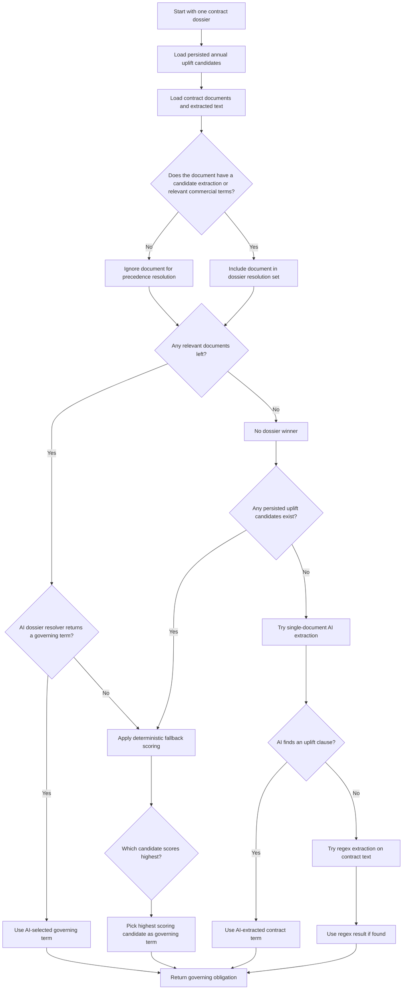

# Governing Term Precedence Decision Tree

This document explains how the Revenue Leakage Investigator decides which document controls the current annual uplift term when multiple files disagree.

## Scope

This precedence logic applies to the revenue leakage clause family used by the MVP:

- annual uplift percent
- notice window
- effective date
- controlling source document

It does not try to determine a universal legal precedence for every contract clause.

## Decision Tree

## Step 1: What counts as relevant

A document participates in precedence resolution if either of these is true:

- it already has an extracted annual uplift candidate
- its text contains commercial terms such as `increase`, `uplift`, `pricing`, `renewal`, `notice`, `supersede`, `override`, `replace`, or `amend`

If neither is true, the document is ignored for governing-term selection.

## Step 2: AI gets first pass

When AI is enabled, the system sends the contract record, document excerpts, and previously extracted candidates into a dossier resolver.

The resolver is instructed to apply these principles:

- later amendments beat earlier language
- explicit override language beats conflicting earlier statements
- later versions can beat earlier versions
- previously extracted candidates are treated as strong hints, not noise

If AI returns a winner, that becomes the governing term.

## Step 3: Deterministic fallback scoring

If AI does not return a governing term, the system scores each candidate and selects the maximum.

The score order is:

1. Explicit precedence hints in clause text
2. Document type rank
3. Higher document version
4. Later effective date
5. Higher extraction confidence

### 1. Explicit precedence hints

Clauses get the strongest boost if their text includes signals like:

- `supersedes`
- `override`
- `replace`
- `controlling`
- `later amendment`
- `latest amendment`
- `most recent`

### 2. Document type rank

If explicit override wording does not settle it, the document type order is:

1. `amendment`
2. `renewal_notice`
3. `order_form`
4. `msa`
5. `nda`

### 3. Version wins within a document family

If two candidates are otherwise similar, a higher version beats a lower version.

Example:

- amendment v4 beats amendment v3

### 4. Later effective date

If the system still needs a tie-break, the candidate with the later effective date wins.

### 5. Confidence score

If all structural tie-breakers are still close, the higher extraction confidence wins.

## Step 4: How upload outcomes are labeled

After the system recomputes the governing term, it compares the old winner and the new winner.

### `no_revenue_impact`

Returned when the uploaded document does not produce any revenue-related uplift candidate.

Typical case:

- business review note
- onboarding memo
- unrelated operations document

### `relevant_non_controlling`

Returned when the uploaded document contains pricing-related language, but the governing economics do not change.

Typical case:

- a supporting renewal memo that repeats the current uplift
- a newer source-of-record document that matches the same uplift, notice window, and effective date

### `controlling_override`

Returned when the uploaded document becomes the governing source or changes the governing economics.

Typical case:

- a later amendment with override wording and a different uplift value
- a higher-version amendment that replaces the previous commercial term

## Practical Examples From This Demo

### Redwood BioLabs

- Uploaded document: `redwood-qbr-unrelated.docx`
- Result: `no_revenue_impact`
- Why: it did not contain pricing, uplift, renewal, or notice language
- Governing source remained: `redwood-commercial-amendment-v1.docx`

### Summit Distribution Group

- Uploaded document: `summit-commercial-amendment-v4.docx`
- Result: `controlling_override`
- Why: it was an amendment, had explicit override language, had the latest version, and stated a 10% uplift that superseded earlier 4%, 6%, and 8% terms
- Governing source changed from: `summit-commercial-amendment-v3.docx`
- Governing source changed to: `summit-commercial-amendment-v4.docx`

## Short Summary

The system decides precedence like this:

1. Ignore irrelevant documents.
2. Let AI resolve the dossier when possible.
3. If AI does not pick a winner, choose the candidate with the strongest override signal.
4. If override wording is not enough, prefer amendment over renewal notice over order form over MSA over NDA.
5. If still tied, prefer the higher version, then later effective date, then higher confidence.

That is why the demo can show three believable outcomes:

- unrelated upload does nothing
- relevant upload can be non-controlling
- later controlling document can override the current source of record