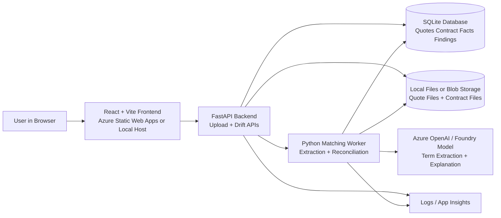

# Quote-to-Contract Drift Detector

## 1. Executive Summary

Quote-to-Contract Drift Detector is an AI-assisted product that compares what sales approved in the quote with what legal ultimately signed in the contract, then highlights changes that materially affect price, scope, support, renewal rights, or downstream delivery.

This idea is narrower than Revenue Leakage Investigator and is easier to explain in one sentence:

- "Did we actually sign what we sold?"

---

## 2. Problem Statement

The commercial promise made during sales is often represented in a structured quote, while the final agreement is captured in unstructured contract language. During negotiation, important business terms can change quietly.

Common examples:

- Number of licenses reduced
- Service package removed
- Support obligations changed
- Payment terms extended
- Renewal increase language weakened
- Discount structure changed

These mismatches create operational confusion and can directly reduce revenue.

---

## 3. Target Users

- Deal desk teams
- Sales operations teams
- Legal operations teams
- Revenue operations teams
- Approval managers who want pre-signature visibility

---

## 4. Hackathon Scope

### In Scope for MVP

- Ingest synthetic quote records and contract text
- Extract commercial terms from the final contract
- Map contract facts to quote line items and commercial attributes
- Detect mismatches
- Classify mismatch severity
- Estimate likely business impact
- Explain findings in plain language

### Out of Scope for MVP

- Full live CPQ integration
- Negotiation assistant workflow
- Automatic redline generation
- Full clause playbook enforcement

---

## 5. Product Shape

This is best presented as a focused detector rather than a broad platform.

### Main Output

- A drift report showing what changed between quote and signed contract

### Key Types of Drift

- Price drift
- Quantity drift
- Scope drift
- Support / services drift
- Payment term drift
- Renewal term drift

---

## 6. End-to-End User Flow

1. User uploads a quote JSON or CSV and a final contract document.
2. The system parses quote fields into normalized commercial facts.
3. The system uses AI to extract corresponding terms from the contract.
4. A reconciliation engine compares quote facts to contract facts.
5. The system highlights mismatches and scores business impact.
6. User opens a drift report showing the exact mismatch and the likely consequence.

---

## 7. AI Responsibilities

### AI Tasks

- Understand contract language describing price, quantity, support, renewal, and obligations
- Match contract clauses to quote concepts even when wording differs
- Explain why a difference matters
- Classify whether a mismatch is likely commercial, legal, or operational

### Non-AI Tasks

- Quote file parsing
- Deterministic field comparison after normalization
- Severity scoring formula
- Report generation and filtering

---

## 8. Architecture Overview

### Logical Components

1. **Quote Loader**
   - Accepts structured quote data
   - Normalizes products, quantities, discounts, support tiers, and renewal terms

2. **Contract Extraction Service**
   - Reads contract text and extracts commercial facts
   - Produces normalized contract-side facts

3. **Term Matching Engine**
   - Aligns quote attributes with contract attributes
   - Handles synonyms and wording differences

4. **Drift Detection Engine**
   - Compares normalized quote facts with normalized contract facts
   - Produces drift findings and severity levels

5. **Explanation Service**
   - Generates plain-language explanation for each drift case

6. **Web UI**
   - Upload screen
   - Drift summary screen
   - Detailed mismatch report

### Suggested Hackathon Stack

- Frontend: React
- Backend API: Python FastAPI or .NET minimal API
- AI orchestration: Python preferred for extraction and matching prompts
- Storage: SQLite or local JSON files

### Recommended Concrete Stack for the Hackathon

- Frontend: React + Vite
- Hosting for frontend: Azure Static Web Apps or local dev server
- Backend API: Python FastAPI
- Matching and extraction worker: Python service logic inside the same backend for MVP
- LLM access: Azure OpenAI or Microsoft Foundry-hosted model
- File storage: local files during hackathon, Azure Blob Storage if deployed
- Structured data store: SQLite for MVP
- Observability: application logs plus optional Azure Application Insights

### Technology and Infrastructure Architecture

This is the recommended deployment shape for the hackathon version.



### Connection Summary

- The browser uploads quote and contract files through the frontend.
- FastAPI receives files and starts drift analysis.
- The worker extracts contract-side commercial facts and matches them to quote facts.
- SQLite stores normalized quote facts, contract facts, and drift findings.
- File storage keeps the raw uploaded documents.
- The hosted model is used for semantic extraction and explanation, while comparison logic stays deterministic.

---

## 9. Logical Processing Flow

This is not the deployment or infrastructure diagram. It is a simplified flow of how quote data and contract data move through the detector after upload.

```text
[Quote CSV / JSON] ---------> [Quote Loader] ---------
                                                  |
                                                  v
                                           [Term Matching Engine] ---> [Drift Detection Engine] ---> [Explanation Service] ---> [UI]
                                                  ^
                                                  |
[Contract Document] --> [Ingestion] --> [LLM Extraction Service] --> [Normalized Contract Facts]
```

---

## 10. Synthetic Data Design

### Core Entities

- `quotes`
- `quote_lines`
- `contracts`
- `contract_facts`
- `drift_findings`

### Minimal Fields

#### quote_lines

- `quote_id`
- `line_id`
- `product_name`
- `quantity`
- `unit_price`
- `discount_percent`
- `support_tier`
- `renewal_uplift_percent`
- `payment_terms_days`

#### contract_facts

- `contract_id`
- `fact_type`
- `fact_key`
- `fact_value`
- `source_clause_text`
- `confidence_score`

#### drift_findings

- `finding_id`
- `quote_id`
- `contract_id`
- `drift_type`
- `quote_value`
- `contract_value`
- `severity`
- `estimated_impact`
- `explanation`

### Seeded Demo Scenarios

- Quote says 1,000 licenses, contract says 900
- Quote includes onboarding, contract omits it
- Quote says net 30, contract says net 90
- Quote has 5% annual uplift, contract caps at 2%
- Quote includes premium support, contract changes to standard support

---

## 11. Detection Logic

### Example Flow

1. Quote parser reads:
   - quantity = 1000
   - renewal uplift = 5%
   - support tier = premium
2. Contract extractor reads:
   - quantity = 900
   - renewal uplift = 2%
   - support tier = standard
3. Matching engine aligns these facts as equivalent attributes.
4. Drift engine creates three findings.
5. Explanation service summarizes likely business impact.

### Severity Heuristic

- High: price, quantity, renewal, liability-linked commercial change
- Medium: support or onboarding change
- Low: wording difference with no commercial effect

---

## 12. API Sketch

### Processing

- `POST /quotes`
- `POST /contracts`
- `POST /analyze/quote-contract-drift`

### Query Results

- `GET /drift-findings`
- `GET /drift-findings/{findingId}`
- `GET /quotes/{quoteId}`
- `GET /contracts/{contractId}/facts`

---

## 13. UI Design

### Screen 1: Upload and Compare

- Upload quote file
- Upload final contract
- Run analysis

### Screen 2: Drift Summary

- Number of mismatches
- High-severity drift count
- Estimated total commercial impact
- Top changed terms

### Screen 3: Detailed Report

- Quote value
- Contract value
- Clause evidence
- Severity
- AI explanation

---

## 14. Demo Narrative

### Demo Script

1. Upload one quote and one final contract.
2. Run comparison.
3. Show three high-severity drifts.
4. Open one drift finding and show:
   - the quote promised value
   - the contract signed value
   - the clause evidence
   - why the change matters
5. Close with the message that the product helps companies avoid signing away revenue and scope by accident.

### One-Sentence Pitch

"Quote-to-Contract Drift Detector tells you when the contract you signed no longer matches the deal you sold."

---

## 15. Key Risks and Mitigations

### Risk: Looks too similar to redlining

Mitigation:

- Emphasize that the product is not rewriting legal language
- Focus on commercial mismatches and downstream business impact

### Risk: Matching looks fuzzy

Mitigation:

- Use a constrained synthetic schema
- Show source evidence for every extracted fact
- Restrict MVP to a few commercial attributes

### Risk: Product feels too narrow

Mitigation:

- Position it as a focused detector that can later plug into the broader Revenue Leakage Investigator platform

---

## 16. Why This Fits Conga

- Strong bridge between CPQ and CLM
- Easy to understand for judges and business stakeholders
- Good use of AI for semantic mapping, not just retrieval
- Convincing with synthetic data

---

## 17. Recommended Build Order

1. Create synthetic quotes and final contracts
2. Build quote parser
3. Build contract extraction for a small set of commercial facts
4. Build matching and drift detection
5. Build explanation generation
6. Build drift report UI