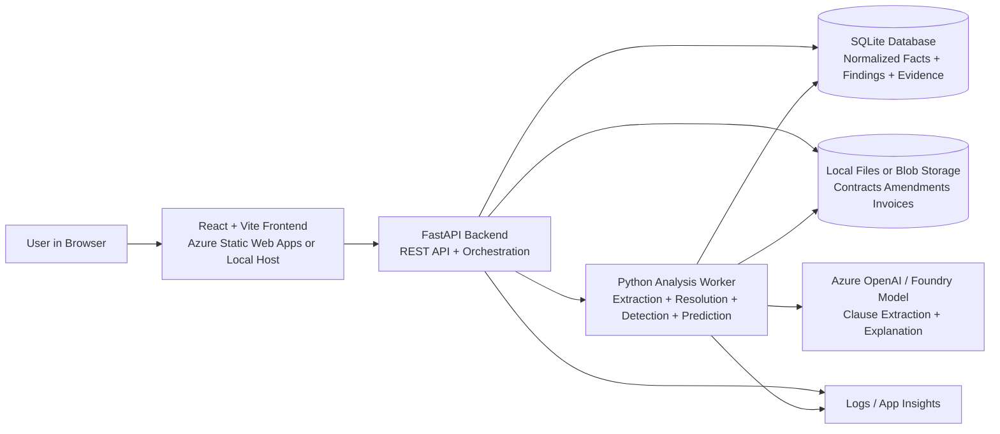

# Revenue Leakage Investigator

## 1. Executive Summary

For the hackathon, this should be presented as a broader AI-assisted commercial execution platform that turns contracts, amendments, billing activity, and renewal signals into operational intelligence.

The platform story is larger than one dashboard or one detector. The core idea is that post-signature revenue execution breaks because commercial intent gets scattered across documents and systems, and AI is needed to reconstruct what the business was actually allowed to do.

The first real shipped agent on that platform is:

- **Missed Renewal/Uplift Finder**

Inside the live demo and UI, this first agent is surfaced as the **Revenue Leakage Investigator** experience.

This framing keeps the story broad enough for Conga's Revenue Lifecycle Management vision, while keeping the first implementation small enough to build convincingly with synthetic data.

---

## 2. Problem Statement

Companies often lose revenue after the deal is signed, not because they sold the wrong thing, but because nobody operationalized the contract correctly.

Common failure modes:

- A contract allows a 5% yearly price increase, but billing never applies it.
- A renewal notice had to be sent 30 days in advance, but nobody acted on it.
- An amendment changed commercial terms, but downstream systems kept using old values.
- A contract committed the customer to a minimum quantity, but invoices never reflected it.

This creates a class of problems that is bigger than contract search and narrower than a full ERP audit. The core problem is commercial rights and obligations getting lost between systems and teams.

### Why Invoices Stay at the Old Amount (Root Causes)

Understanding _why_ this happens is critical to positioning the solution:

1. **System Disconnect** (most common) — The contract lives in CLM (Conga), but billing lives in ERP (SAP/NetSuite/Oracle). Nobody manually updates the ERP price schedule after renewal. The systems don't talk, so billing just rolls forward at the old rate.

2. **No One Owns the Uplift Action** — Sales closed the deal and moved on. Legal signed the contract and filed it. Finance bills based on what ERP says. Nobody's job description says "go read clause 7.2 and raise the price on the anniversary."

3. **Amendment Confusion** — The original MSA says 5% uplift. Then an amendment changes it to 3%. Then a renewal notice references the original 5%. Three systems have three different numbers, so the ops team does nothing rather than guess wrong.

4. **Notice Window Missed** — Contract says: "Seller may increase price by 5% with 30 days written notice before renewal." The renewal date passes without anyone sending the notice letter, and the right to uplift expires for that year.

5. **Billing System Limitations** — Many ERPs don't support "auto-escalate price by X% on anniversary." The price is a static field. Someone must manually create a new price list entry, and that manual step gets dropped.

6. **Customer Pushback Avoidance** — Account managers know they _can_ raise the price but choose not to because they fear churn. This is a business decision, but it's invisible — finance doesn't know revenue was left on the table intentionally vs. accidentally.

### What This Means for the Product

| Without the tool | With the tool |
|-----------------|---------------|
| Nobody knows uplift was missed | System flags it within days of the anniversary |
| Dollar impact is invisible for years | Dashboard shows exact dollar impact per account |
| "Whose fault is it?" finger-pointing | Evidence trail: here's the clause, here's the invoice, here's the gap |
| Reactive (found during annual audit) | Proactive (found before next billing cycle) |
| Requires a human to read every contract | AI reads every clause and reconciles against billing automatically |

### How Invoice/Billing Data Gets Into the System

The platform does not replace the ERP or billing system. It sits alongside them and cross-references contract rights against actual billing history. The integration is intentionally lightweight.

#### Integration Methods (Production)

| Method | How It Works | Best For |
|--------|-------------|----------|
| **Scheduled ERP Export** | Daily/weekly flat file or API export of invoice lines from SAP, NetSuite, or Oracle into the platform | Most enterprises |
| **Data Warehouse Join** | Company already lands ERP invoices + CLM contracts into Snowflake/Databricks; platform reads from there | Data-mature orgs |
| **Salesforce Billing Object** | If billing is Salesforce-native (Salesforce Billing, Zuora CPQ), the data is already in the same org as Conga | Salesforce-heavy orgs |
| **CSV/Excel Upload** | Finance exports a billing report and uploads it manually | Quickest proof-of-value |
| **Webhook/Event Stream** | ERP publishes invoice-created events to a message bus; platform subscribes | Real-time detection |

#### What the Platform Needs from Billing

The minimum data required per invoice line is intentionally small:

| Field | Purpose |
|-------|---------|
| `contract_id` | Links the invoice back to the governing contract |
| `billing_period_start` / `billing_period_end` | Identifies which period this charge covers |
| `amount_billed` | The actual dollar amount charged |
| `quantity` | Number of units billed (for per-seat contracts) |

This is data every ERP already tracks. No schema changes to the billing system are required.

#### Why This Works Without Live ERP Access

- **Uplift leakage is slow-moving.** A missed 5% increase accumulates over months/years. Even a weekly or monthly data feed catches it.
- **The comparison is retrospective.** The platform asks: "After the anniversary date, did invoices reflect the new price?" A daily sync is unnecessary — monthly is sufficient.
- **No write-back required.** The platform flags the gap and tells a human what to do. It never modifies the ERP directly.

#### Hackathon Demo Approach

For the hackathon, invoice data is pre-loaded as synthetic records in the `invoice_lines` PostgreSQL table. This simulates a periodic ERP extract without requiring an actual ERP connection. The synthetic data shows invoices that remain flat at the original price even after the uplift anniversary — exactly what a real ERP export would show when the price schedule was never updated.

#### Key Message for Judges

> "Give us a billing extract — even a spreadsheet — and we'll cross-reference it against what the contract actually permits. The gap between those two numbers is your leaked revenue. No ERP modification needed. No real-time sync required."

---

## 3. Target Users

- Revenue operations teams
- Deal desk teams
- Sales operations teams
- Billing operations teams
- Customer renewal managers
- Legal operations teams that want visibility into post-signature execution

---

## 4. Hackathon Scope

### In Scope for MVP

- Ingest synthetic contracts, amendments, invoices, and renewal metadata
- Extract renewal and uplift rights from contract text
- Normalize those rights into structured fields
- Compare extracted rights with invoice history and renewal events
- Flag missed actions
- Estimate lost revenue
- Explain the finding in plain language
- Show a ranked work queue of opportunities

### Out of Scope for MVP

- Live integration with Conga, Salesforce, ERP, or billing systems
- Full quote-to-cash reconciliation across every object type
- Automated remediation in external systems
- Training a proprietary model from scratch

---

## 5. Product Shape

This should be pitched as a multi-agent commercial execution intelligence platform with a common evidence layer.

The broader platform answers a larger question:

- What did the contract actually allow?
- What changed across amendments and versions?
- What operational action should have happened next?
- Where is money, risk, or execution quality drifting from the signed commercial truth?

### Platform Layer

- Shared ingestion pipeline
- Shared contract extraction pipeline
- Shared evidence graph / normalized facts store
- Shared explanation and case assembly service
- Shared governing-term resolution across conflicting documents
- Shared agent framework for detection, prevention, and investigation workflows

### First Real Agent

- **Missed Renewal/Uplift Finder**, surfaced in the demo as **Revenue Leakage Investigator**

This first agent proves the platform can:

- read conflicting PDFs and DOCX files
- resolve which commercial term is actually controlling
- compare contractual rights with what billing and renewal operations actually did
- quantify financial impact and recommended next action

### Future Agents

- Contract Obligation Auto-Tracker
- Quote-to-Contract Drift Detector
- Billing-vs-Contract Mismatch Finder
- Amendment Impact Detector

### Positioning Guidance For The Demo

Lead with the platform, not the detector.

- The platform is the durable story.
- Revenue Leakage Investigator is the first operational agent running on top of it.
- The same evidence layer can support multiple downstream agents without rebuilding ingestion, extraction, or explanation logic.

---

## 6. End-to-End User Flow

1. User uploads synthetic contracts, amendments, and invoice history.
2. The system parses contract text and extracts commercial rights.
3. The system normalizes those rights into structured facts and resolves which document currently controls the commercial term.
4. A platform-level evidence layer stores those facts so multiple agents can reuse them.
5. The Missed Renewal/Uplift Finder compares those facts against actual billing and renewal actions.
6. The system flags misses, calculates likely lost revenue, and shows supporting evidence.
7. User opens a case view and sees:
   - what the contract allowed
   - what actually happened
   - why this is likely a leakage event
   - estimated financial impact
   - recommended next action

The important platform message is that steps 1 through 4 are reusable for other agents, while step 5 is the first use case.

---

## 7. AI Responsibilities

AI should be used where rules alone become brittle.

### AI Tasks

- Extract renewal, uplift, notice, and pricing clauses from messy contract text
- Resolve meaning across contract versions and amendments
- Map text language into normalized commercial facts
- Explain why the case matters in business terms
- Rank findings by likely importance and confidence

### Non-AI Tasks

- File ingestion
- Simple schema validation
- Deterministic revenue math once fields are normalized
- UI rendering and case filtering

This separation is important for the pitch. The AI is doing semantic understanding and evidence interpretation, not basic arithmetic.

---

## 8. Architecture Overview

### Logical Components

1. **Document Ingestion Service**
   - Accepts contracts, amendments, and invoice files
   - Produces document metadata and raw text

2. **Contract Extraction Service**
   - Uses LLM-assisted extraction to identify renewal dates, notice windows, uplift terms, pricing structure, and service commitments
   - Outputs normalized facts with confidence scores

3. **Evidence Store**
   - Stores normalized contract facts, amendment facts, invoice records, and case evidence
   - Can be implemented as JSON files, SQLite, or a simple document database for the hackathon

4. **Governing Term Resolution Service**
   - Reconciles conflicting contract language across master agreements, order forms, renewal notices, and amendments
   - Chooses the currently controlling commercial term using AI-first dossier reasoning with deterministic fallback precedence

5. **Leakage Detection Engine**
   - Compares extracted rights against invoice history and renewal event data
   - Detects likely missed uplift or renewal actions
   - Computes estimated missed revenue

6. **Leakage Prevention / Prediction Engine**
   - Looks ahead to upcoming renewal dates, notice deadlines, uplift anniversaries, and billing cycles
   - Predicts which accounts are likely to become leakage cases soon
   - Recommends preventive actions before the miss happens

7. **Explanation Service**
   - Converts structured findings into human-readable explanations
   - Summarizes the key evidence behind the finding

8. **Web UI**
   - Dashboard of findings
   - Upcoming risk queue
   - Case detail view
   - Contract evidence pane
   - Revenue impact summary

The first four components are the reusable platform substrate. The leakage detection and prevention engines are the first packaged agent behavior on top of that substrate.

### Suggested Hackathon Stack

- Frontend: React
- Backend API: Python FastAPI or .NET minimal API
- AI orchestration: Python preferred for extraction pipeline
- Storage: SQLite or local JSON files
- LLM: hosted model for extraction and explanation

### Recommended Concrete Stack for the Hackathon

- Frontend: React + Vite
- Hosting for frontend: Azure Static Web Apps or local dev server
- Backend API: Python FastAPI
- Background processing: Python worker running inside the same FastAPI service for MVP
- Contract text extraction: LLM calls through Azure OpenAI or Microsoft Foundry-hosted model
- File storage: local files during hackathon, Azure Blob Storage if deployed
- Structured data store: SQLite for MVP
- Optional cache / job queue: in-memory queue for MVP, Redis only if needed
- Observability: application logs plus optional Azure Application Insights

### Technology and Infrastructure Architecture

This is the recommended deployment shape for the hackathon version.



### Connection Summary

- The browser talks only to the FastAPI backend.
- The FastAPI backend handles uploads, case queries, and dashboard APIs.
- The Python worker performs extraction, governing-term resolution, leakage detection, and prediction logic.
- SQLite stores normalized facts, governing evidence, predicted risks, and leakage cases.
- File storage holds raw contracts, amendments, and invoice files.
- The hosted model is called for extraction, dossier-level term resolution, and explanation, not for deterministic math.

---

## 9. Logical Processing Flow

This is not the deployment or infrastructure diagram. It is a simplified flow of how data moves through the product after files are uploaded.

```text
[Synthetic Data Files]
        |
        v
[Ingestion Service] --> [Raw Text + Metadata]
        |
        v
[LLM Extraction Service] --> [Normalized Contract Facts]
                  |
                  v
               [Evidence Store]
            /           \
                v             v
          [Invoice / Renewal Loader]   [Leakage Detection Engine]
                |             |
                v             v
       [Leakage Prevention / Prediction Engine]
                |
                v
           [Explanation Service]
                |
                v
          [Dashboard UI]
```

---

## 10. Synthetic Data Design

### Core Entities

- `accounts`
- `contracts`
- `amendments`
- `invoice_lines`
- `renewal_events`
- `extracted_obligations`
- `leakage_cases`
- `risk_predictions`

### Minimal Fields

#### contracts

- `contract_id`
- `account_id`
- `product_name`
- `term_start`
- `term_end`
- `base_price`
- `currency`
- `raw_contract_text`

#### extracted_obligations

- `contract_id`
- `obligation_type`
- `value`
- `effective_date`
- `notice_window_days`
- `source_clause_text`
- `confidence_score`

#### invoice_lines

- `invoice_id`
- `account_id`
- `contract_id`
- `billing_period_start`
- `billing_period_end`
- `amount_billed`
- `quantity`

#### leakage_cases

- `case_id`
- `contract_id`
- `case_type`
- `expected_value`
- `actual_value`
- `estimated_impact`
- `confidence_score`
- `explanation`
- `status`

#### risk_predictions

- `prediction_id`
- `contract_id`
- `risk_type`
- `risk_window_start`
- `risk_window_end`
- `predicted_impact`
- `confidence_score`
- `recommended_action`
- `supporting_evidence`

### Seeded Demo Scenarios

- Missed annual uplift
- Missed renewal notice
- Amendment changed price but billing did not update
- Minimum commitment not billed
- Support uplift omitted for premium tier

---

## 11. Detection Logic

The live demo should make clear that leakage detection is one platform use case built on top of a reusable contract intelligence layer.

### Example Rule + AI Hybrid Flow

1. LLM extracts: "Price increases by 5% annually with 30 days notice."
2. Parser normalizes:
   - `obligation_type = annual_uplift`
   - `value = 5%`
   - `notice_window_days = 30`
3. Detection engine checks invoice data after anniversary date.
4. If billed amount stayed flat, the case is flagged.
5. Explanation service produces a plain-language summary.

### How To Prevent Leakage Before It Happens

The product should not stop at detection. It should also create an upcoming risk queue.

Example prevention flow:

1. LLM extracts: "Price increases by 5% annually with 30 days notice."
2. Parser normalizes the anniversary date and notice deadline.
3. Prevention engine checks today's date against that deadline.
4. If the notice date is 21 days away and no renewal or pricing action exists, the system flags a predicted leakage risk.
5. The UI shows a preventive alert such as: "Send renewal notice in the next 21 days or you may miss a 5% uplift worth an estimated $48K."

### Predictive Analysis Approach

For the hackathon, predictive analysis should be framed as risk scoring, not heavy machine learning.

Inputs for prediction:

- Upcoming renewal dates
- Upcoming notice windows
- Presence or absence of amendment activity
- Past invoice behavior
- Whether uplift was historically applied or missed
- Whether required actions are already recorded in the workflow data

Possible outputs:

- `High risk of missed uplift in next 30 days`
- `High risk of renewal notice failure before deadline`
- `Medium risk that billing will continue using old price after amendment`

This is credible with synthetic data because the model can be a hybrid of deterministic deadline logic plus lightweight risk scoring.

### Why Hybrid Matters

- Pure rules struggle to read contract language reliably.
- Pure LLM reasoning is too loose for reproducible revenue calculations.
- Hybrid gives semantic extraction plus deterministic math and explainable risk scoring.

### Why This Supports A Platform Story

- The same extraction and governing-term resolution layer can support multiple agents.
- Leakage detection is only the first packaged workflow that consumes those facts.
- Future agents can reuse the same contract evidence, document precedence reasoning, and explanation infrastructure.

---

## 12. API Sketch

### Upload and Processing

- `POST /documents/contracts`
- `POST /documents/amendments`
- `POST /data/invoices`
- `POST /analyze/revenue-leakage`

### Query Results

- `GET /cases`
- `GET /cases/{caseId}`
- `GET /predictions`
- `GET /predictions/{predictionId}`
- `GET /contracts/{contractId}/facts`
- `GET /dashboard/summary`

---

## 13. UI Design

### Screen 1: Executive Dashboard

- Total estimated missed revenue
- Total predicted at-risk revenue
- Number of flagged accounts
- Number of missed uplift cases
- Number of missed renewal cases
- Highest-impact findings

### Screen 2: Findings Queue

- Account name
- Case type
- Estimated impact
- Confidence
- Recommended action

### Screen 3: Upcoming Risk Queue

- Account name
- Predicted risk type
- Days until deadline
- Predicted impact
- Recommended preventive action

### Screen 4: Case Detail

- Original clause excerpt
- Normalized obligation facts
- Invoice timeline
- Expected versus actual comparison
- AI explanation

---

## 14. Demo Narrative

The demo should open with the platform story and then narrow into Revenue Leakage Investigator as the first live agent.

### Demo Script

1. Start with the broader platform framing: this system turns contract documents and downstream operational data into an evidence layer for multiple post-signature agents.
2. Explain that the live demo is one concrete agent running on that layer: Revenue Leakage Investigator, specifically the Missed Renewal/Uplift Finder.
3. Open the dashboard and show that the agent surfaces both detected leakage and upcoming risk, not just document search.
4. Click one high-impact missed uplift case.
5. Show the conflicting source documents and the exact clause that the system resolved as controlling.
6. Show invoice history proving the increase was never applied.
7. Show the AI explanation, source-of-record verdict, and lost revenue estimate.
8. Switch to the upcoming risk queue and show one contract that has not failed yet but is likely to fail soon.
9. Show the preventive recommendation, such as sending notice before the deadline.
10. Optionally upload a new document and show that the same platform can determine whether it is irrelevant, relevant but non-controlling, or a true override.
11. Close by explaining that the same ingestion, extraction, precedence resolution, and evidence stack can power other agents like amendment impact detection and quote-to-contract drift detection.

### Suggested Opening Talk Track

"This is not just a revenue leakage dashboard. The broader product is a commercial execution intelligence platform. It reads the contract dossier, resolves which terms actually control, compares that truth to what operations did, and then different agents can act on top of that evidence. Revenue Leakage Investigator is the first live agent on that platform."

### One-Sentence Pitch

"We are building a commercial execution intelligence platform, and Revenue Leakage Investigator is the first agent that finds revenue your contracts allowed you to charge, but your operations never captured."

---

## 15. Key Risks and Mitigations

### Risk: Extraction quality looks unreliable

Mitigation:

- Use simpler synthetic clauses for demo
- Show source clause text beside normalized facts
- Add confidence scores and evidence snippets

### Risk: Platform story feels too broad

Mitigation:

- Demo only Missed Renewal/Uplift Finder
- Present the rest as roadmap agents on the same evidence layer

### Risk: Users ask why this is not just search

Mitigation:

- Emphasize that the product detects missed business action and quantifies impact, not just finds documents

### Risk: Users ask if prediction is fake or too simple

Mitigation:

- Position prediction as explainable risk scoring, not black-box forecasting
- Show the exact contract clause, deadline, and missing operational evidence behind the prediction
- Keep the prediction logic transparent for the demo

---

## 16. Why This Fits Conga

- Strong fit with Conga's Revenue Lifecycle Management story
- Uses contracts as commercial source-of-truth, not just legal artifacts
- Expands beyond redlining and Q&A into execution intelligence
- Creates a reusable evidence layer that can support multiple Conga-adjacent AI agents
- Can be demoed convincingly with synthetic data alone

---

## 17. Recommended Build Order

1. Create synthetic contracts, amendments, and invoices
2. Build a minimal extraction and governing-term resolution pipeline for uplift and renewal clauses
3. Build the shared evidence layer and normalized facts model
4. Build deterministic leakage detection rules as the first agent behavior
5. Build explanation generation
6. Build upcoming risk prediction logic
7. Build dashboard, risk queue, and case detail UI
8. Add roadmap placeholders for future agents that reuse the same evidence layer